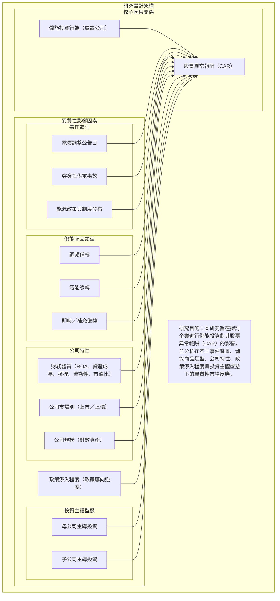

```mermaid
graph TD
    subgraph 研究設計架構
        Purpose["研究目的：本研究旨在探討企業進行儲能投資對其股票異常報酬（CAR）的影響，並分析在不同事件背景、儲能商品類型、公司特性、政策涉入程度與投資主體型態下的異質性市場反應。"]

        subgraph 核心因果關係
            A["儲能投資行為（處置公司）"] --> B["股票異常報酬（CAR）"]
        end

        subgraph 異質性影響因素
            subgraph 事件類型
                C1["電價調整公告日"]
                C2["突發性供電事故"]
                C3["能源政策與制度發布"]
            end

            subgraph 儲能商品類型
                D1["調頻備轉"]
                D2["電能移轉"]
                D3["即時／補充備轉"]
            end

            subgraph 公司特性
                E1["財務體質（ROA、資產成長、槓桿、流動性、市值比）"]
                E2["公司市場別（上市／上櫃）"]
                E3["公司規模（對數資產）"]
            end

            F["政策涉入程度（政策導向強度）"]

            subgraph 投資主體型態
                G1["母公司主導投資"]
                G2["子公司主導投資"]
            end
        end

        C1 --> B
        C2 --> B
        C3 --> B
        D1 --> B
        D2 --> B
        D3 --> B
        E1 --> B
        E2 --> B
        E3 --> B
        F --> B
        G1 --> B
        G2 --> B
    end
```
